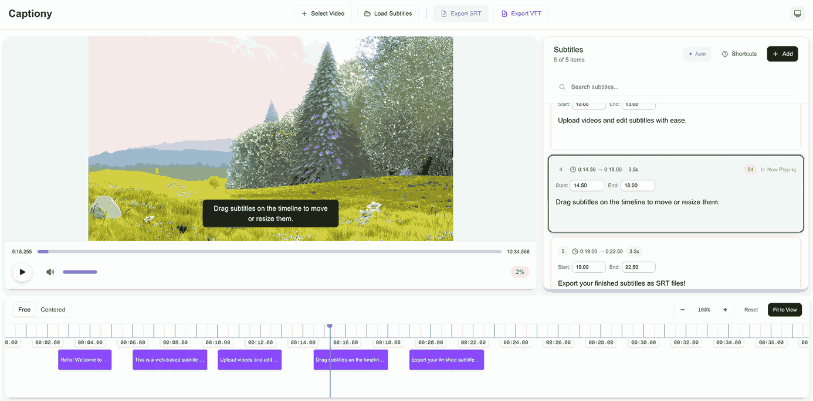

# Captiony

An intuitive and lightweight web-based subtitle editor for YouTube. Open-source, fast, and easy to use. 🎥✍️



## Features

### Core Features

- **Video Upload & Playback** - Support for all major video formats
- **Timeline-Based Editing** - Visual timeline with drag-and-drop subtitle manipulation
- **Real-time Preview** - See subtitles overlaid on video as you edit
- **Auto-Save** - Automatic localStorage persistence prevents data loss
- **Keyboard Shortcuts** - Professional editing workflow with comprehensive shortcuts
- **Dark Mode** - Beautiful dark/light theme support

### Subtitle Management

- **Add & Edit Subtitles** - Create and modify subtitle text with precise timing
- **Drag & Resize** - Adjust timing by dragging subtitle bars on the timeline
- **Timeline Modes**
  - Free mode: Navigate timeline freely
  - Centered mode: Playhead stays centered for easier editing
- **Import/Export**
  - Import: SRT, VTT formats
  - Export: SRT, VTT formats

### User Experience

- **Responsive Design** - Works seamlessly on desktop and tablet
- **Exit Protection** - Warns before leaving page to prevent accidental data loss
- **Timeline Zoom** - Zoom in/out for precise or overview editing
- **Visual Feedback** - Dimmed past timeline for better focus

## Demo

Try it live at: [captiony.vercel.app](https://captiony.vercel.app)

## Getting Started

### Prerequisites

- Node.js 18.17.0 or later
- npm, yarn, pnpm, or bun

### Installation

1. Clone the repository

```bash
git clone https://github.com/zeikar/captiony.git
cd captiony
```

2. Install dependencies

```bash
npm install
# or
yarn install
# or
pnpm install
# or
bun install
```

3. Run the development server

```bash
npm run dev
# or
yarn dev
# or
pnpm dev
# or
bun dev
```

4. Open [http://localhost:3000](http://localhost:3000) in your browser

## Usage

### Basic Workflow

1. **Upload Video**: Click "Select Video" to upload your video file
2. **Add Subtitles**: Click the "+" button or use keyboard shortcuts to add subtitle entries
3. **Edit Timing**: Drag subtitle bars on the timeline or edit timestamps directly
4. **Edit Text**: Click on subtitle text to edit in the right panel
5. **Export**: Download your subtitles as SRT or VTT files

### Keyboard Shortcuts

- `Space` - Play/Pause video
- `←/→` - Seek backward/forward 5 seconds
- `Shift + ←/→` - Seek backward/forward 1 second
- `↑/↓` - Navigate between subtitles
- `Enter` - Start editing selected subtitle
- `Delete` - Delete selected subtitle
- `+/-` - Zoom timeline in/out
- `?` - Show keyboard shortcuts help

## Project Structure

```
app/                      - Next.js App Router pages
  page.tsx                - Main application page
  layout.tsx              - Root layout with theme provider
components/
  editor/                 - Subtitle editor components
    CaptionEditor.tsx     - Main editor container
    VideoPlayer.tsx       - Video playback component
    SubtitleTimeline.tsx  - Timeline visualization
    SubtitleEditor.tsx    - Subtitle text editor
    ToolBar.tsx           - Import/export toolbar
    components/           - Granular UI components
      SubtitleBar.tsx
      TimelineGrid.tsx
      TimelinePlayhead.tsx
      VideoUploader.tsx
      ...
  layout/                 - Layout components
    NavBar.tsx            - Top navigation bar
  ui/                     - Reusable UI components
    DarkModeToggle.tsx
lib/
  stores/                 - Zustand state management
    subtitle-store.ts     - Subtitle data and operations
    video-store.ts        - Video playback state
  metadata.ts             - SEO metadata configuration
public/                   - Static assets
```

## Technical Stack

- **Framework**: Next.js 15 (App Router)
- **Language**: TypeScript
- **Styling**: Tailwind CSS 4
- **State Management**: Zustand with localStorage persistence
- **UI Components**: Headless UI, Heroicons
- **File Handling**: FileSaver.js
- **Analytics**: Vercel Analytics

## Key Features in Detail

### Auto-Save System

Subtitles are automatically saved to browser localStorage as you work. When you return to the app, your work is automatically restored, preventing data loss from accidental page closures or browser crashes.

### Timeline Editing

The timeline provides a visual representation of your subtitles over time. You can:
- Drag subtitle bars to change their position
- Resize bars by dragging edges to adjust duration
- Zoom in for frame-accurate editing
- Zoom out for an overview of your entire subtitle track

### Import/Export

- **Import**: Load existing SRT or VTT subtitle files to continue editing
- **Export**: Download your subtitles in industry-standard SRT or VTT formats compatible with YouTube, video players, and professional editing software

## Browser Compatibility

Captiony works best in modern browsers:
- Chrome/Edge 90+
- Firefox 88+
- Safari 14+

## Contributing

Contributions are welcome! Please feel free to submit a Pull Request.

1. Fork the repository
2. Create your feature branch (`git checkout -b feature/amazing-feature`)
3. Commit your changes (`git commit -m 'Add amazing feature'`)
4. Push to the branch (`git push origin feature/amazing-feature`)
5. Open a Pull Request

## License

This project is licensed under the MIT License - see the LICENSE file for details.

## Acknowledgements

- [Next.js](https://nextjs.org/) - The React framework
- [Tailwind CSS](https://tailwindcss.com/) - Utility-first CSS framework
- [Zustand](https://zustand-demo.pmnd.rs/) - State management
- [Heroicons](https://heroicons.com/) - Beautiful icons

---

Built with ❤️ by [zeikar](https://github.com/zeikar)
